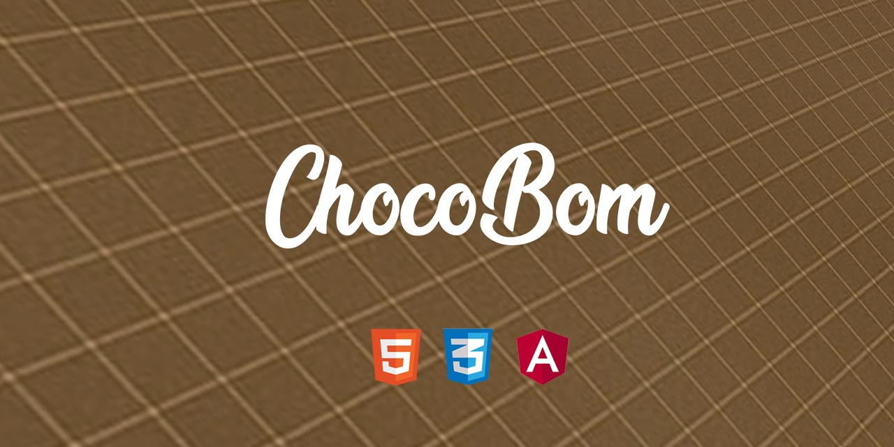
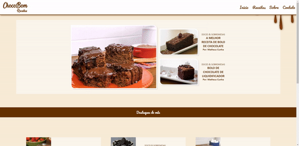
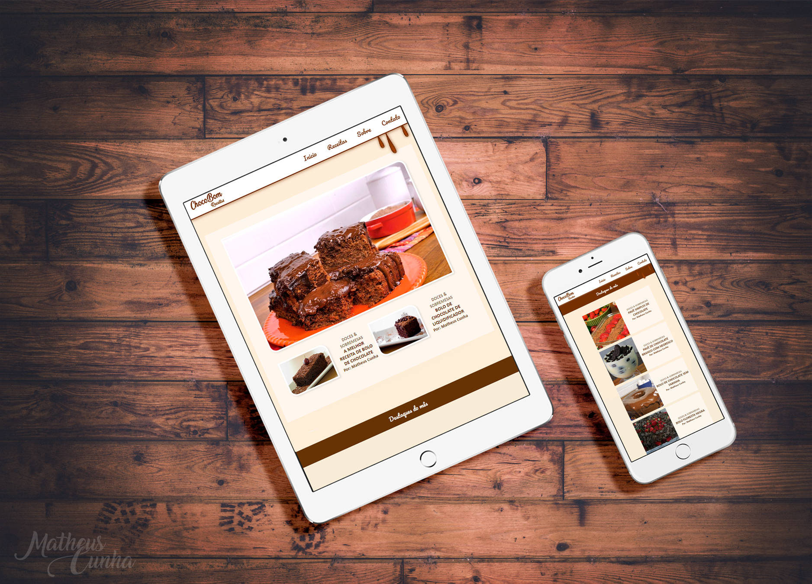

# Chocobom Receitas.

> Este projeto foi criado utilizando uma versão do Angular Cli (https://github.com/angular/angular-cli) versão 7.3.5.

---

<div style="width: 100%;">



</div>

---

## Uso de Marca e projeto.

Este projeto tem cunho didático, inclusive logotipia e conteúdo fictício, com o objetivo, apenas apresentar de forma clara a distribuição de informações e estruturas  comummente utilizadas em rotinas de desenvolvimento.  
 
A ChocoBom é uma empresa fictícia criada por mim apenas para este projeto, basicamente é um pequeno site de receitas gastronomicas que envolvem chocolate. O logotipo e o layout da página foram desenvolvidos com este briefing.

A página apresenta receitas "em alta" primeiramente e logo após esta sessão, uma seleção das melhores da semana.

---

## Servidor de testes.

Para execução do projeto será necessário a instalação dos pacotes do cliente Angular, siga o passo a passo a seguir:

> Instale via terminal os arquivos necessarios para compilação do projeto. Em seguida execute o comando para iniciar o servidor de testes:
```shell
$ npm install
$ ng serve
```

Navegue até http://localhost:4200/ para ver a página compilada, se preciso atualize a mesma para poder visualizar as alterações.
Utilizando o servidor de testes, todas as modificações do codigo serão interpretadas pelo navegador e atualizaram automaticamente.

---

## Status do projeto.

- [x] Logotipia.
- [ ] Desenvolvimento de projeto.
- [x] Projeto base.
- [ ] Responsividade.
- [ ] Feedback.

---

## Ferramentas utilizadas.

| Ferramenta        | Utilização                                |
|---------------|-----------------------------------------------|
| HTML              | Criação do código base da página.         |
| CSS3              | Edição de estilos das páginas.            |
| Angular Cli       | Desenvolvimento de componentes.           |
| Photoshop CS6     | Layout e edições de imagem.               |
| Illustrator CS6   | Desenvolvimento de logotipia.             |

---

## Contribua!

Este projeto possui código aberto para casos de opiniões, dicas ou feedback. Para isso, siga os seguintes passos:

### Passo 1

- Faça um Fork ou Clone este repositório.

### Passo 2

- Desenvolva, altere e trabalhe da forma que preferir.

### Passo 3

- Crie um novo pull request e aguarde a análise.

Por menor que seja o pull request, agradeço desde já sua contribuição. Todo o conhecimento é bem vindo!

---

## Contato.

Me siga nas redes sociais! 

[Website](https://matheus-cunha.github.io/)

[Pinterest](https://br.pinterest.com/portifoliomatheuscunha/)

[Email](matheus.cunha.sjc@gmail.com)
